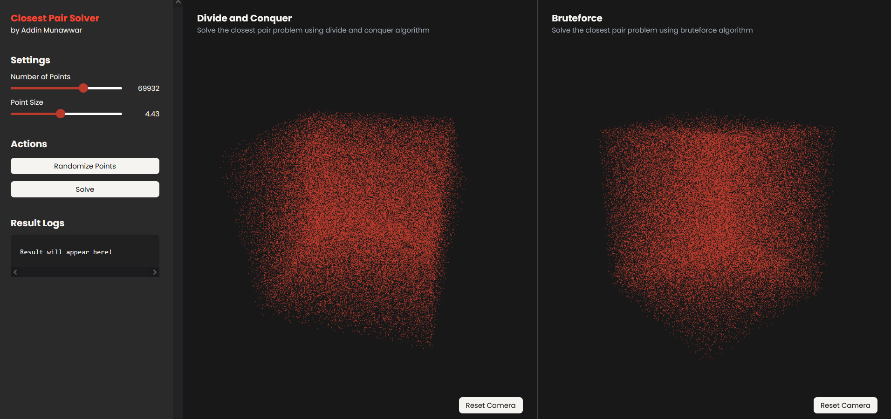
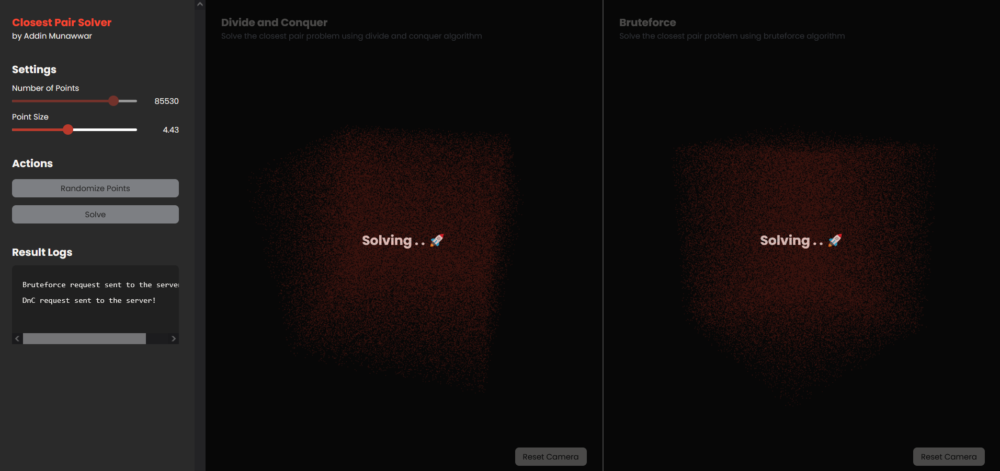
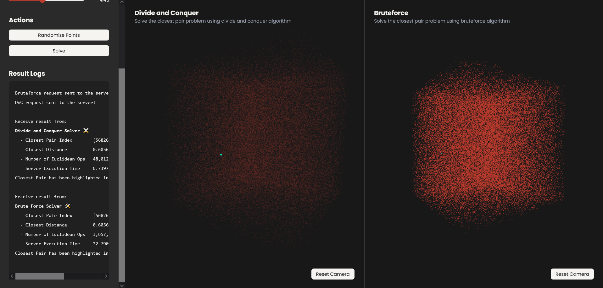
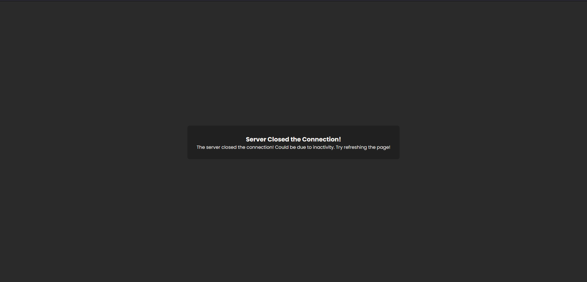

<h1 align="center">Closest Pair Solver 📍<br>Bruteforce vs DnC Algorithm</h1>

> This project is part of my CS202 Challenge. More details about it on [my website](https://cadevue.com)! (updated soon)

## Try Now!
This application can be tried out immediately! The web application can be accessed in this link: <br>
https://closest-pair-frontend.pages.dev/

## Project Description 
A web application that solve the closest pair problem using 2 kind of algorithm — Brute Force and Divide and Conquer. The number of points handled by the application is ~ <b>10,000 to 100,000</b> points. 

The frontend is built using Typescript and Three.js, while the backend is built using Golang. The program is deployed using Cloudflare Pages (frontend) and Docker-AWS EC2 (backend). The communication between the frontend and backend is done using websocket.

Here is the specification of the request and response for the websocket communication:
```go
type SolveCPRequest struct {
	Method    string    `json:"method"`
	Dimension int32     `json:"dimension"`
	Points    []float64 `json:"points"`
}

type SolveCPResponse struct {
	Method            string   `json:"method"`
	Indexes           [2]int32 `json:"indexes"`
	Distance          float64  `json:"distance"`
	NumOfEuclideanOps int64    `json:"numOfEuclideanOps"`
	ExecutionTime     float64  `json:"executionTime"`
}
```

## Frontend
https://github.com/cadevue/closest-pair-frontend/tree/master

The technologies used for the frontend are:
- **Typescript** for the web scripting language
- **Three.js** for the 3D rendering of the points
- **Vite** for the frontend bundler
- **TailwindCSS** for the styling
- **Websocket** for the communication with the backend
- **Cloudflare Pages** for the deployment

## Backend
https://github.com/cadevue/closest-pair-backend/tree/master

The technologies used for the backend are:
- **Golang** for the backend language
- **Docker** for the containerization
- **AWS EC2** for the deployment
- **Websocket** for the communication with the frontend
- **Github Actions** for the CI/CD pipeline

## Deployment
The web application can be accessed in this link: <br>
https://closest-pair-frontend.pages.dev/

## Screenshots 
Here are some screenshots of the closest pair solver web application.

### Application Idle


### Solving the Closest Pair


### Result Visualization and Logs


### Connection Close when Idle

